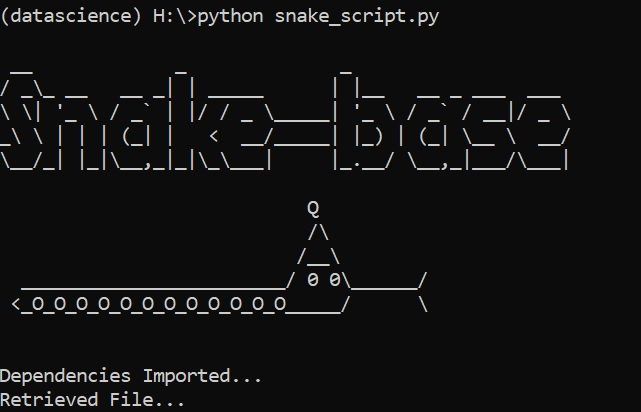

# data-pipeline
## using fuzzywuzzy to prevent duplicate db records
* grabs data from a database and a shared folder and compares fields against one another to avoid creating duplicate records.
* requires pandas, and fuzzywuzzy

Can be Run with Windows Task Scheduler,
to find your python.exe run this code separately:
(this is the program that is run, the arguments is the path to the script.)
```import sys
print("Python EXE : " + sys.executable)
